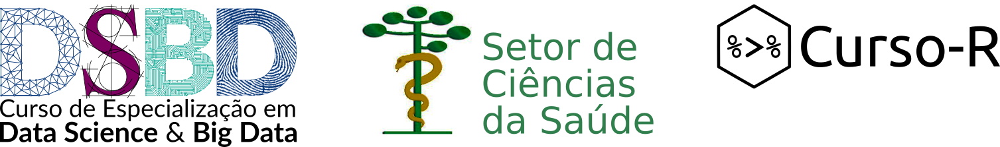

```{r, include=FALSE}
source("setup_knitr.R")
```

# Apoiadores do R Day

<br>

<center>
<a href="https://coletum.com/pt_BR">

</a>
</center>

<p style="font-size:250%; text-align:center; font-family:'Lato', sans-serif;">
Qualquer dado. Qualquer lugar.
 </p>

<br>
<br>

```{r, echo=FALSE}

```

<br>
<br>
<br>

# Endossado por

<center>
<a href="https://www.r-project.org/foundation/">

</a>
</center>

<p style="font-size:300%; text-align:center; font-family:'Lato', sans-serif;">
The R Foundation
</p>
