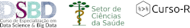

```{r setup, include=FALSE}
source("setup_knitr.R")
```

<link href="https://fonts.googleapis.com/css?family=Lato" rel="stylesheet">

```{r, echo=FALSE, out.width='100%'}
knitr::include_graphics("img/r-day.svg")
```

<p style="font-size:350%; text-align:center; font-family:'Lato', sans-serif; font-weight:bold; color:black">
R Day </p>

<p style="font-size:325%; text-align:center; font-family:'Lato', sans-serif, font-weight:bold; color:black">
Encontro nacional de usuários do R </p>

<p style="font-size:300%; text-align:center; font-family:'Lato', sans-serif, font-weight:bold; color:black">
UFPR - Curitiba, PR </p>

<p style="font-size:300%; text-align:center; font-family:'Lato', sans-serif, font-weight:bold; color:black">
22/05/2018 </p>

<br>

<div style="width:100%;"> <!-- Main Div -->
<div style="float:left; width:49%;">
<p style="font-size:200%; text-align:center; font-family:'Lato', sans-serif">
Endossado por:
</p>
<center>

<a href="https://www.r-project.org/foundation/">
<p style="font-size:250%; text-align:center; font-family:'Lato', sans-serif; color:black;">
The R Foundation
</p>
</a>
</center>
</div>
<div style="float:right; width:49%;">
<p style="font-size:200%; text-align:center; font-family:'Lato', sans-serif">
Apoio:
<center>
<a href="https://coletum.com/pt_BR">

</a>
<br>
<br>

</center>
</div>
</div>
