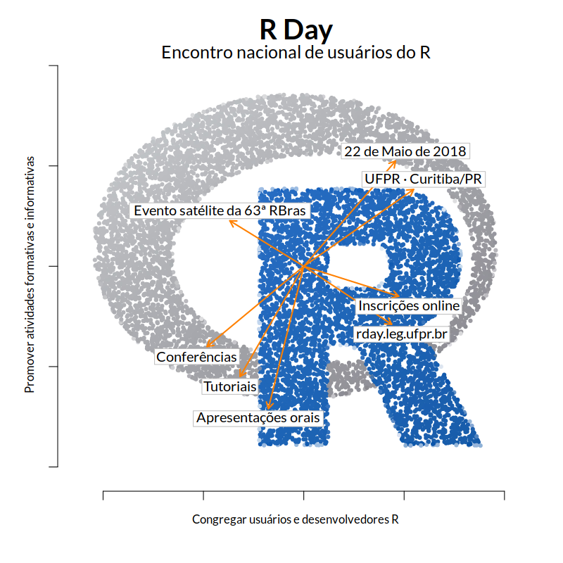

```{r setup, include=FALSE}
source("setup_knitr.R")
```

<!-- <br> -->

```{r, echo=FALSE, out.width='100%'}

```

<!-- <br> -->

<link href="https://fonts.googleapis.com/css?family=Lato" rel="stylesheet">

<p style="font-size:325%; text-align:center; font-family:'Lato', sans-serif">
Encontro nacional de usuários do R </p>

<p style="font-size:300%; text-align:center; font-family:'Lato', sans-serif">
UFPR - Curitiba, PR </p>

<p style="font-size:300%; text-align:center; font-family:'Lato', sans-serif">
22/05/2018 </p>

<br>

<div style="width:100%;"> <!-- Main Div -->
<div style="float:left; width:49%;">
<p style="font-size:200%; text-align:center; font-family:'Lato', sans-serif">
Endossado por:
</p>
<p style="font-size:250%; text-align:center; font-family:'Lato', sans-serif; color:black;">
The R Foundation
</p>
</div>
<div style="float:right; width:49%;">
<p style="font-size:200%; text-align:center; font-family:'Lato', sans-serif">
Apoio:
</p>
```{r, echo=FALSE, out.width='60%'}

```
</div>
</div>
